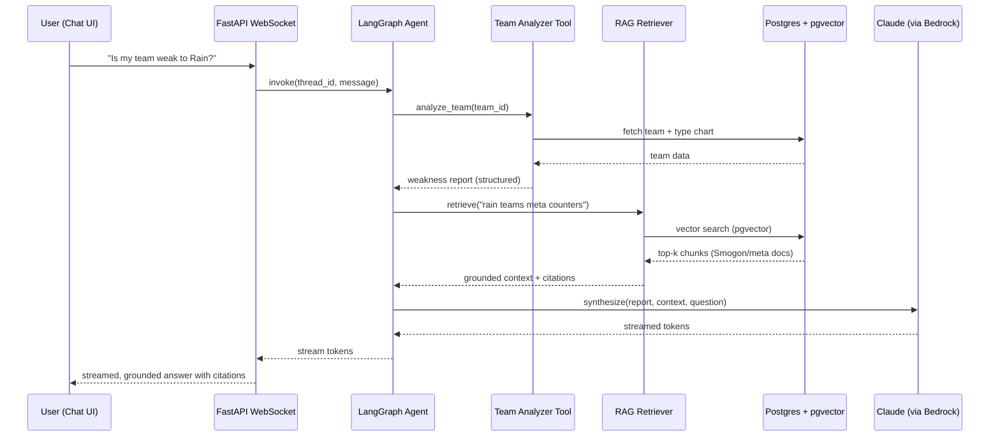
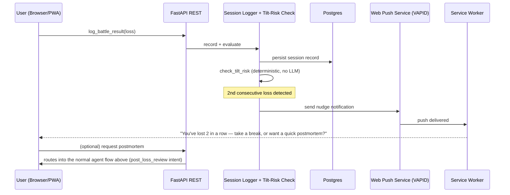

# Architecture

## System overview

```mermaid
flowchart TB
    subgraph Client["Frontend (React + TS + Vite, PWA)"]
        UI[Team Builder / Analyzer UI]
        Chat[Coach Chat — streaming]
        Session[Session Check-in UI]
        Push[Push Notification Handler\n(Web Push via service worker)]
    end

    subgraph Edge["FastAPI (Python)"]
        REST[REST endpoints]
        WS[WebSocket endpoints]
        Auth[Auth / session]
    end

    subgraph AgentLayer["Agent Layer (LangGraph)"]
        Router[Router node]
        Tools[Tool-calling nodes]
        Synth[Synthesis node]
    end

    subgraph ToolsImpl["Tools"]
        Calc[Damage Calc Engine\n(deterministic, no LLM)]
        TeamAnalyzer[Team Analyzer]
        MegaProfile[Mega Evolution Profile\n(deterministic, no LLM)]
        MetaLookup[Meta / Usage Stats Lookup]
        ReplayParser[Showdown Replay Parser]
        RAGTool[RAG Retriever]
        SessionLog[Session Logger +\nTilt-Risk Check\n(deterministic, no LLM)]
    end

    subgraph Notify["Notifications"]
        WebPush[Web Push service\n(VAPID, via the PWA's service worker)]
    end

    subgraph MCPLayer["MCP Server (standalone)"]
        MCP[DexTrAIner MCP Server]
    end

    subgraph Data["Data Layer"]
        PG[(PostgreSQL\n+ pgvector, on RDS)]
        Valkey[(Valkey\ncache + queue, via ElastiCache)]
        S3[(Amazon S3\nreplays, PDFs)]
    end

    subgraph Workers["Background Workers (Arq)"]
        Ingest[Ingestion / Indexing\n(LlamaIndex)]
        ReplayJob[Replay Parse Jobs]
        Scrape[Tournament Data Scrapers]
    end

    subgraph Models["LLM Providers (via Amazon Bedrock + direct APIs)"]
        Claude[Claude — primary\nreasoning/synthesis]
        OpenAI[OpenAI — router/co-primary]
        Gemini[Gemini — multimodal/bulk-ingestion specialist]
    end

    subgraph Obs["Observability"]
        LangSmith[LangSmith]
        Langfuse[Langfuse]
        Sentry[Sentry]
        PostHog[PostHog]
    end

    UI --> REST
    Chat <--> WS
    Session --> REST
    REST --> Auth
    WS --> AgentLayer
    REST --> ToolsImpl

    Router --> Tools
    Tools --> Calc
    Tools --> TeamAnalyzer
    Tools --> MegaProfile
    Tools --> MetaLookup
    Tools --> ReplayParser
    Tools --> RAGTool
    Tools --> Synth
    Synth --> Models

    MCP --> Calc
    MCP --> TeamAnalyzer
    MCP --> MetaLookup
    MCP --> ReplayParser

    RAGTool --> PG
    TeamAnalyzer --> PG
    MegaProfile --> PG
    MetaLookup --> PG
    Auth --> PG
    WS --> Valkey

    SessionLog --> PG
    SessionLog -.tilt-risk detected.-> WebPush
    WebPush -.push.-> Push
    REST --> SessionLog

    Workers --> PG
    Workers --> S3
    ReplayJob --> S3
    Scrape --> PG

    AgentLayer -.traces.-> LangSmith
    AgentLayer -.traces.-> Langfuse
    Edge -.errors.-> Sentry
    Client -.events.-> PostHog
```

## Component responsibilities

### Frontend
React SPA, built as an installable PWA (web app manifest + service worker) — this is the only committed distribution mechanism; a native Google Play wrapper (Capacitor) is documented as an optional, unscheduled stretch goal, not a planned deliverable (see [`tech-stack.md`](./tech-stack.md#mobile--distribution)). Talks to FastAPI over REST for CRUD-shaped operations (teams, tournament data, user settings, session/battle-result logging) and over WebSocket for anything that streams (chat responses). TanStack Query owns all server-state caching; Zustand owns transient UI/editor state (e.g., the team currently being built, before it's saved). The push-notification handler is the browser's native Push API/service worker (Web Push) — works on Android and, as of 2026, iOS Safari too.

### FastAPI edge
Thin layer: auth, request validation (Pydantic/SQLModel), routing to either direct data-layer operations (simple CRUD) or the agent layer (anything that needs reasoning). Deliberately does **not** put agent logic in the route handlers themselves — routes call into the agent layer as a black box that takes a request and returns/streams a typed response.

### Agent layer (LangGraph)
The core "coach reasoning" graph. A typical turn:

1. **Router node** — classifies intent (team analysis question? damage-calc question? replay review? open-ended meta question?) and decides which tools are in scope.
2. **Tool-calling node(s)** — calls into the deterministic tools (damage calc, team analyzer), the RAG retriever, and/or the meta-stats lookup, in parallel where possible.
3. **Synthesis node** — takes tool outputs + retrieved context and produces the final grounded response via Claude (default for reasoning-heavy synthesis, e.g., a replay postmortem) or OpenAI (routine/high-volume turns), with Gemini reserved for multimodal input. See [`tech-stack.md`](./tech-stack.md#cloud-and-model-provider-decision-revisited) for why this provider mix, not Gemini-as-default.

This graph is intentionally kept small and legible at first — the risk with LangGraph is over-building graph complexity before it's earned. New nodes get added when a real product need forces a new branch, not speculatively.

### Tools
Plain Python modules/classes, each with a Pydantic input/output schema. Every tool is usable from three places without duplication:
- Directly from a REST endpoint (e.g., "just run the damage calc" with no LLM involved at all)
- From inside the LangGraph agent, as a tool call
- From the standalone MCP server, as an MCP tool

The **damage calculator, team analyzer, Mega Evolution profile, and session logger/tilt-risk check are all deterministic tools that never touch an LLM** — they're plain Python computed against known-correct formulas and simple rules (e.g., the "two-loss rule" from [`product-research.md`](./product-research.md)). The agent's job is to call them and explain the result in context, not to compute or approximate any of it. This matters doubly for the tilt-risk check specifically: it needs to fire reliably and immediately after a logged loss, which a rules engine does deterministically and an LLM call would make slower, more expensive, and less predictable for no benefit.

### MCP server
A separate lightweight FastAPI (or the official MCP Python SDK's own server) process that wraps the same tool implementations behind the MCP protocol — stdio and Streamable HTTP transports. This lets any MCP-aware client (Claude Desktop, Cursor, a future third-party integration) use DexTrAIner's Pokémon tools directly, independent of the main chat product. See [`ai-agents-and-rag.md`](./ai-agents-and-rag.md) for the tool contracts.

### Data layer
Single PostgreSQL instance on RDS (with the pgvector extension) holds relational data (users, teams, tournaments, battle history) *and* vector embeddings side by side — one transactional boundary, no dual-write consistency problems between a relational store and a separate vector store. Valkey (via Amazon ElastiCache — see [`tech-stack.md`](./tech-stack.md#backend) for why Valkey, not Redis) handles caching, rate limiting, and pub/sub for WebSocket fan-out. Amazon S3 holds large blobs (raw replay files, uploaded tournament PDFs).

### Background workers
Arq workers, backed by the same Valkey instance, handle everything that isn't request/response-shaped:
- **Ingestion/indexing** — LlamaIndex-driven parsing of new Smogon pages, tournament reports, and usage-stat exports into pgvector.
- **Replay parsing** — turning a raw Showdown replay log into a structured turn-by-turn game state, which the agent later reasons over.
- **Scraping/sync jobs** — periodic pulls of meta/usage stats and tournament results.

### Observability
LangGraph/LangChain traces flow to both LangSmith (primary, tightest integration) and Langfuse (learn/compare, self-hosted). Sentry catches unhandled errors across frontend and backend. PostHog tracks product usage. RAGAS and promptfoo run in CI (see below), not in this runtime diagram, but their golden datasets are seeded from real failures surfaced in LangSmith/Langfuse traces — closing the eval loop.

## Request flow example: "Is my team weak to Rain?"



## Request flow example: Mental-Game Coach nudge

Unlike the flow above, this one is server-initiated, not a response to a user question — worth calling out explicitly since it's an architecturally different shape (event-driven, not request/response).



## CI/CD pipeline

```mermaid
flowchart LR
    PR[Pull Request] --> Lint[Lint + Typecheck]
    Lint --> UnitTests[pytest / Vitest]
    UnitTests --> EvalGate[RAGAS + promptfoo\nregression gate]
    EvalGate --> Build[Docker build]
    Build --> Deploy[Deploy to AWS Fargate\n(staging)]
    Deploy --> E2E[Playwright E2E]
    E2E --> Prod[Promote to prod]
```

A prompt or retrieval change that regresses against the golden eval set fails in CI the same way a broken unit test would — this is the closed loop referenced in [`tech-stack.md`](./tech-stack.md).
